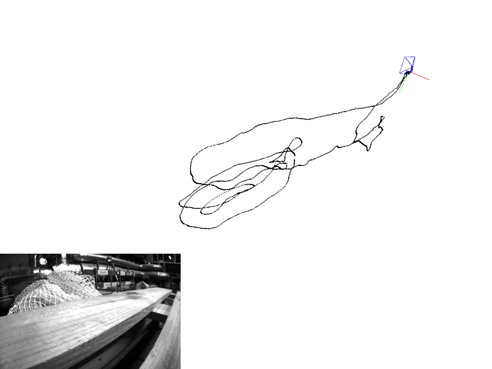

# Stereo MSCKF Starter Code for [WPI's](https://www.wpi.edu/) [RBE/CS549](https://nitinjsanket.github.io/teaching/rbe549/fall2022.html) by [Prof. Nitin J. Sanket](https://nitinjsanket.github.io/)
See [the course website](https://nitinjsanket.github.io/teaching/rbe549/fall2022.html) for more details. The code was modified by [Dr. Lening Li.](https://lening.li/)

MSCKF (Multi-State Constraint Kalman Filter) is an EKF based **tightly-coupled** visual-inertial odometry algorithm. [S-MSCKF](https://arxiv.org/abs/1712.00036) is MSCKF's stereo version. This project is a Python reimplemention of S-MSCKF, the code is directly translated from official C++ implementation [KumarRobotics/msckf_vio](https://github.com/KumarRobotics/msckf_vio).  


For algorithm details, please refer to:
* Robust Stereo Visual Inertial Odometry for Fast Autonomous Flight, Ke Sun et al. (2017)
* A Multi-State Constraint Kalman Filterfor Vision-aided Inertial Navigation, Anastasios I. Mourikis et al. (2006)  

## Requirements
* Python 3.6+
* numpy
* scipy
* cv2
* [pangolin](https://github.com/uoip/pangolin) (optional, for trajectory/poses visualization)

## Setup

The steps below are tested on macOS and set up visualization support (`--view`).

1. Install system dependencies:

```bash
xcode-select --install
brew install python@3.11 cmake glew eigen ffmpeg
```

2. From the repository root, create and prepare a Python 3.11 virtual environment:

```bash
cd /path/to/RBE-549-p
/opt/homebrew/bin/python3.11 -m venv .venv311
./.venv311/bin/python -m pip install --upgrade pip setuptools wheel
./.venv311/bin/python -m pip install numpy scipy opencv-python PyOpenGL pybind11
```

3. Build the local Pangolin Python module:

```bash
cd Group11_p4/Code/pangolin
rm -rf build311
mkdir build311
cd build311

PYBIND11_DIR=/path/to/RBE-549-p/.venv311/lib/python3.11/site-packages/pybind11/share/cmake/pybind11

cmake .. \
	-DBUILD_PYTHON=ON \
	-DBUILD_PANGOLIN_PYTHON=OFF \
	-DPYTHON_EXECUTABLE=/path/to/RBE-549-p/.venv311/bin/python \
	-DPYTHON_INCLUDE_DIR=/opt/homebrew/opt/python@3.11/Frameworks/Python.framework/Versions/3.11/include/python3.11 \
	-DPYTHON_LIBRARY=/opt/homebrew/opt/python@3.11/Frameworks/Python.framework/Versions/3.11/lib/libpython3.11.dylib \
	-Dpybind11_DIR="$PYBIND11_DIR" \
	-DCMAKE_PREFIX_PATH="/opt/homebrew;$PYBIND11_DIR" \
	-DCMAKE_CXX_FLAGS='-I/opt/homebrew/include'

cmake --build . -j8
```

4. Run with visualization:

```bash
cd /path/to/RBE-549-p/Group11_p4/Code
/path/to/RBE-549-p/.venv311/bin/python vio.py --view --path ../Data/MH_01_easy
```

If you do not need visualization, you can always run without `--view`:

```bash
/path/to/RBE-549-p/.venv311/bin/python vio.py --path ../Data/MH_01_easy
```

## Dataset
* [EuRoC MAV](http://projects.asl.ethz.ch/datasets/doku.php?id=kmavvisualinertialdatasets): visual-inertial datasets collected on-board a MAV. The datasets contain stereo images, synchronized IMU measurements, and ground-truth.  
This project implements data loader and data publisher for EuRoC MAV dataset.

## Run  
`python vio.py --view --path path/to/your/EuRoC_MAV_dataset/MH_01_easy`  
or    
`python vio.py --path path/to/your/EuRoC_MAV_dataset/MH_01_easy` (no visualization)  

## Results
MH_01_easy  


## License and References
Follow [license of msckf_vio](https://github.com/KumarRobotics/msckf_vio/blob/master/LICENSE.txt). Code is adapted from [this implementation](https://github.com/uoip/stereo_msckf).